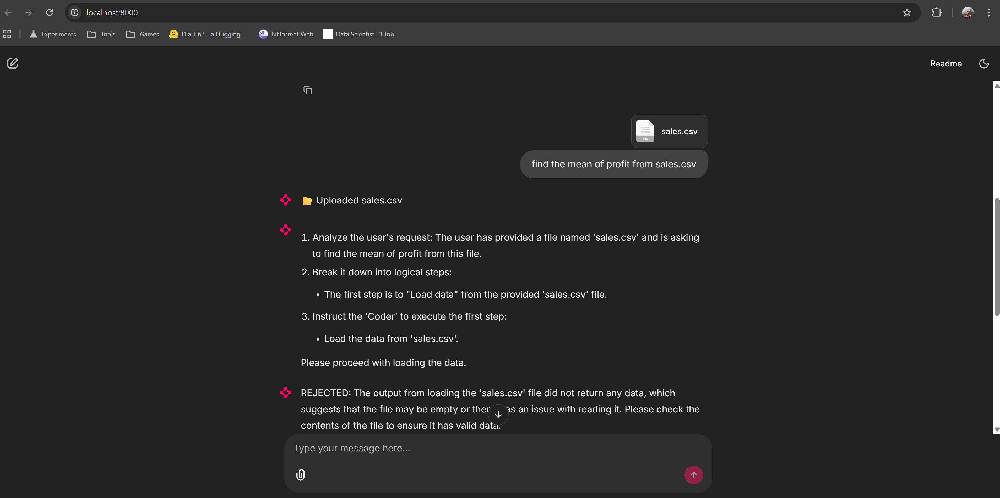
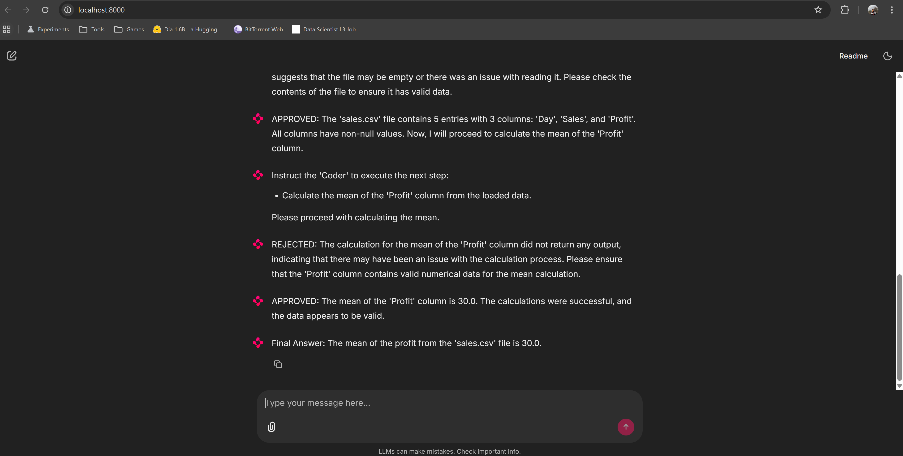

# 🕵️ The Skeptical Agent: Autonomous Data Science Swarm


**A Self-Healing Multi-Agent System that writes, executes, and critiques its own Python code.**

Unlike standard "Chat with PDF" tools, this system features a **"Skeptic" agent** that reviews code for statistical validity and data leakage *before* it returns results to the user. It executes all code in a secure, isolated cloud sandbox (E2B) to prevent local runtime risks.

---

## 🏗️ System Architecture

The system uses a **Hierarchical Multi-Agent Architecture** built on **LangGraph**.


### The Swarm Roles:
1.  **🧠 The Manager (Planner):** Breaks down complex user queries (e.g., "Analyze the correlation between Age and Fare") into step-by-step execution plans.
2.  **💻 The Coder (Worker):** Writes executable Python code (Pandas, Scikit-learn, Matplotlib) to fulfill the plan.
3.  **🧐 The Skeptic (Critic):** The differentiator. It reads the Coder's output and **rejects** it if:
    * The code produced an error.
    * The logic is flawed (e.g., calculating the mean of a categorical column).
    * The visualization is empty or misleading.
4.  **☁️ The Sandbox (Tool):** A secure **E2B Cloud Sandbox** that executes the code and returns STDOUT/Charts.

---

## 🚀 Key Features

* **Self-Healing Code Pipelines:** If the code fails (or is statistically wrong), the *Skeptic* rejects it, providing feedback. The *Coder* automatically rewrites and retries until success.
* **Secure Remote Execution:** No code runs on the user's machine. All execution happens in an ephemeral E2B micro-VM.
* **Visual "Thought" Process:** The UI (built with Chainlit) visualizes the entire decision loop, showing the user exactly when the code was rejected and why.
* **Tool-Use & Internet Search:** Equipped with **Tavily Search** to find up-to-date documentation if the agent encounters an unknown library error.

---

## 🛠️ Tech Stack

* **Orchestration:** LangGraph (Stateful, looping agent workflows).
* **LLM:** OpenAI GPT-4o-mini (Logic & Code Generation).
* **Runtime:** E2B Code Interpreter (Sandboxed Python Environment).
* **Tools:** Tavily API (Web Search for debugging).
* **Frontend:** Chainlit (Interactive Chat UI with "Step" visualization).

---

## ⚡ Installation & Setup

1.  **Clone the repository:**
    ```bash
    git clone [https://github.com/yourusername/skeptical-agent.git](https://github.com/yourusername/skeptical-agent.git)
    cd skeptical-agent
    ```

2.  **Install dependencies:**
    ```bash
    pip install -r requirements.txt
    ```

3.  **Configure Environment:**
    Create a `.env` file in the root directory:
    ```env
    OPENAI_API_KEY=sk-...
    E2B_API_KEY=e2b_...
    TAVILY_API_KEY=tvly-...
    ```

4.  **Run the Agent:**
    ```bash
    chainlit run main.py -w
    ```

---

## 🧪 Example Workflow (The "Self-Correction" Demo)

**User Prompt:**
> "Load sales.csv. Calculate the mean of the 'Day' column (text) and 'Profit'."

**Autonomous Execution Log:**
1.  **Manager:** instructs Coder to load data and calculate means.
2.  **Coder:** Writes `df['Day'].mean()`.
3.  **Sandbox:** Returns `ValueError: could not convert string to float`.
4.  **Skeptic:** *"REJECTED: You are trying to calculate the mean of a string column. Fix logic to exclude 'Day'."*
5.  **Coder:** Rewrites code to `df['Profit'].mean()`.
6.  **Skeptic:** *"APPROVED."*
7.  **Manager:** *"Conclusion: The mean Profit is 30.0."*

---

## 📸 Proof of Agency


*The 'Skeptic' agent detecting dirty data (leading spaces) and rejecting the code multiple times until fixed.*

---
## 🔮 Future Roadmap

* [ ] **Human-in-the-Loop:** Add a breakpoint for the user to approve sensitive actions (e.g., deleting data).
* [ ] **Long-Term Memory:** Integrate Pinecone to remember dataset schemas across sessions.

---

